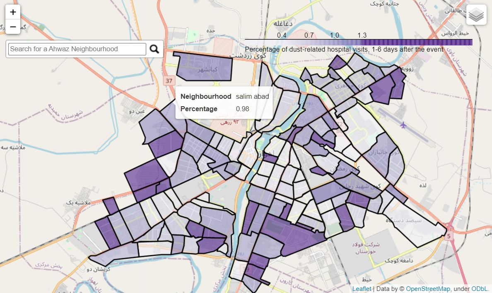
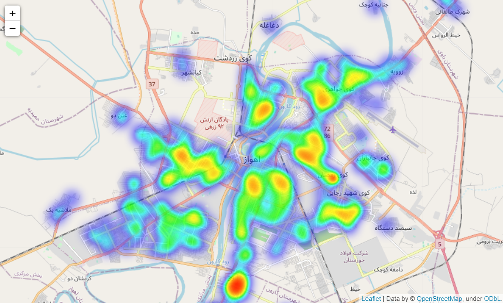

# DustStorms_Health_Risk_Assessment

Southwestern Iran dust storms Health Risk Assessment, including spatial and time-series analyses of dust-related diseases during a 4.5-year period. Finally, an LSTM model was trained to predict the health risks associated with dust and sand storms. It is important to note that only part of this project is available in this repository.
To make sure the maps in spatial analysis notebooks are not missed, here are screenshots of the maps.

